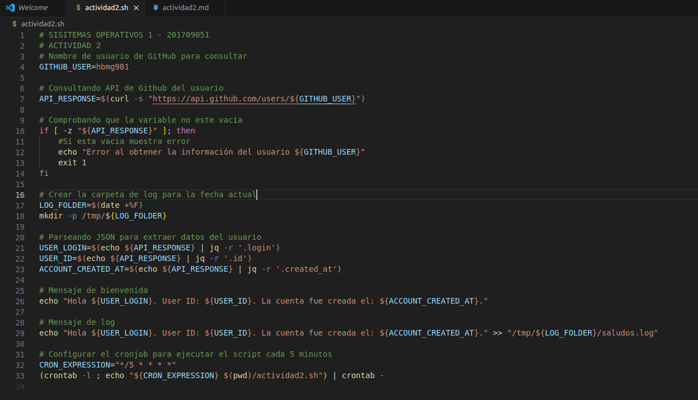
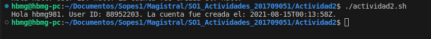
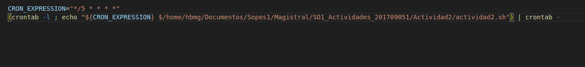
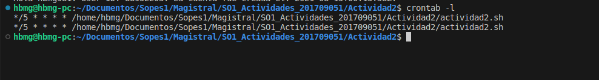
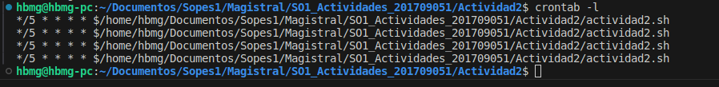
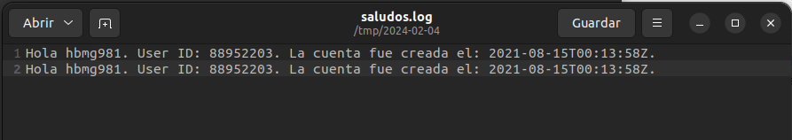
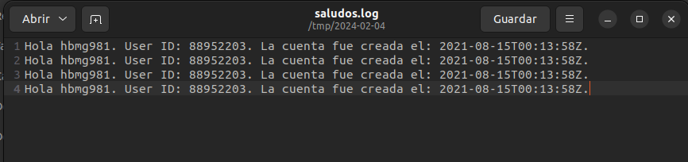

# SISTEMAS OPERATIVOS 1 SECCION A  - ACTIVIDAD 2 - 201709051

## Creación del Script .sh 

[

## Ejecutando el script de consulta de usuario en la API de GitHub

[

## Creación del Cronjob para ejecutar el Script cada 5 minutos

[

## Verificación del Cronjob con contrab -l

[

- Minutos después

[

## Log de ejecución de Script

[

- Minutos después

[
