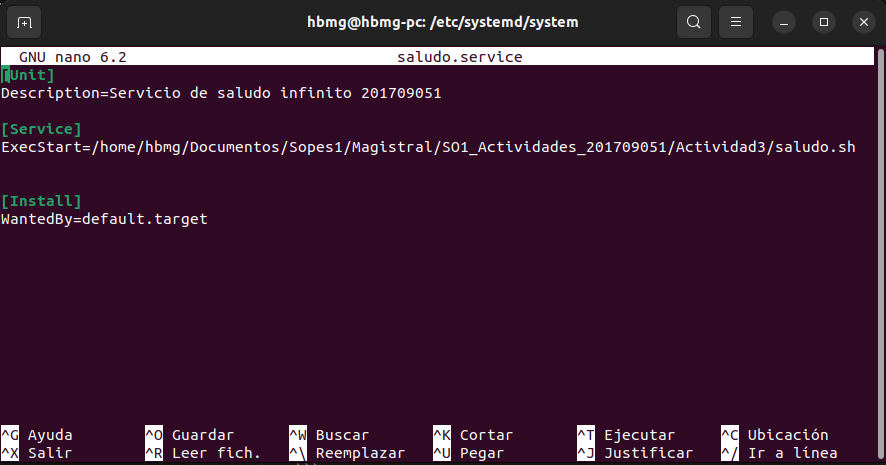
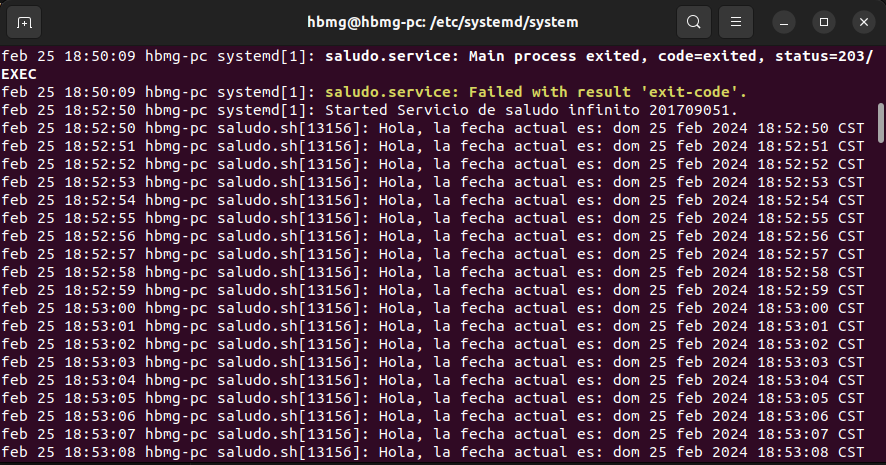
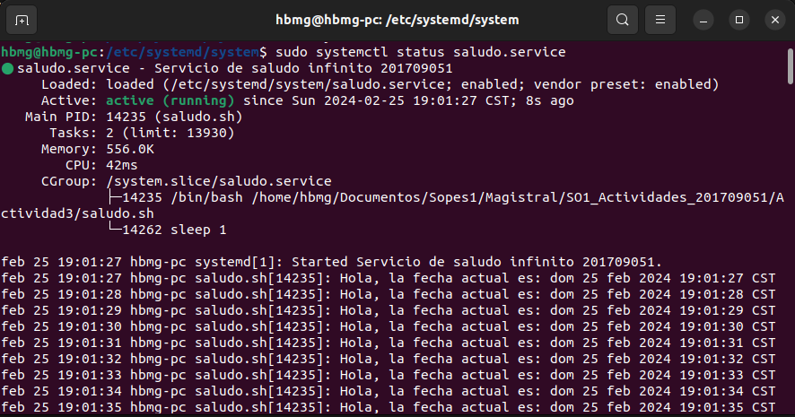

# ACTIVIDAD 3 - SO1 - 201709051


Este servicio ejecuta un script que imprime un saludo y la fecha actual infinitamente con una pausa de un segundo.

## Creación de archivo saludo.sh

Script para el saludo.sh
```bash
#!/bin/bash
# script para saludo con fecha 201709051
while true
do
    echo "Hola, la fecha actual es: $(date)"
    sleep 1
done
```
Script para saludo.service 
```bash
[Unit]
Description=Servicio de saludo infinito 201709051

[Service]
ExecStart=/home/hbmg/Documentos/Sopes1/Magistral/SO1_Actividades_201709051/Actividad3/saludo.sh

[Install]
WantedBy=default.target
```
## Instalación del servicio
#### Ir a la ruta  `/etc/systemd/system/`

Crear archivo `saludo.service` y pegar el script para el servicio:

```bash
sudo nano saludo.service
```



## Habilitación y ejecución del servicio:

```bash
sudo systemctl enable saludo.service
sudo systemctl start saludo.service
```

## Verificación de Logs

```bash
journalctl -u saludo.service
```
#### Vista previa de los logs


## Comprobar estado de servicio 
```bash
sudo systemctl status saludo.service
```

