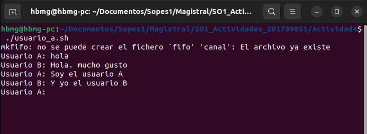
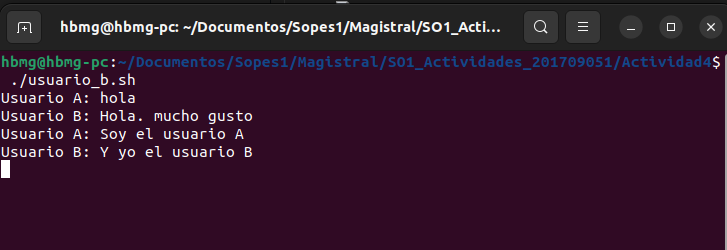

# Chat Basico con Named Pipes 
## Actividad 4 SO1 - 201709051

Este es un ejemplo básico de chat utilizando pipes.

### Se crean los script para los usuarios A y B 
Se utiliza un pipe denominado canal para la comunicación de tipo FIFO y luego se crea el bucle para el chat, para leer y enviar mensajes.

### Ejecución de Scripts para iniciar el Chat

- En una terminal ejecutar el script del usuario A 
```bash 
./usuario_a.sh 
```
- En otra terminal ejecutar el script del usuario B
```bash 
./usuario_b.sh 
```

## Muestra de ejecución

- Vista en la terminal del usuario A



- Vista en la terminal de usuario B



La comunicación para este caso se inicia desde el usuario A que empieza la conversación, luego cada chat puede enviar y recibir mensajes
